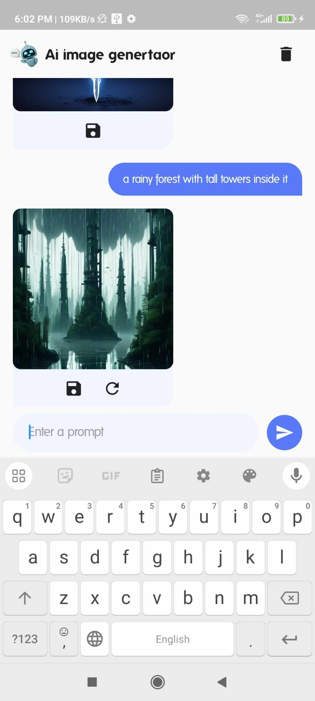
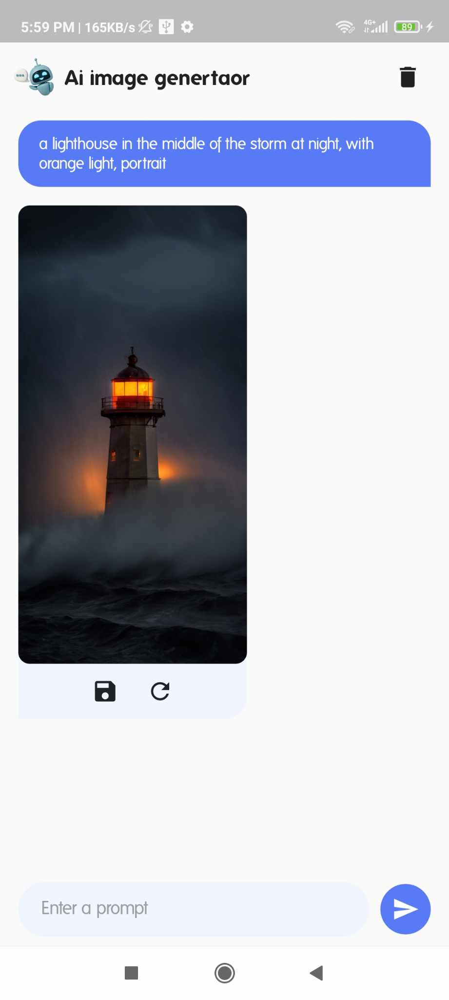

# AI Image Generator

## Overview

AI Image Generator is a Flutter-based mobile application that allows users to generate images using AI text prompts. The application leverages the Stable Diffusion API to convert user inputs into images. Users can interact with the app through a chat-like interface, save generated images to their device, and regenerate images based on previous prompts.

## Features

1. **Text-to-Image Generation**: Users can input text prompts, and the application generates images based on these prompts using the Stable Diffusion API.
2. **Message Storage**: The app stores user prompts and AI-generated messages in a local SQLite database, allowing for persistent chat history.
3. **Image Saving**: Users can save generated images to their device storage, which are then added to the device's gallery.
4. **Regeneration**: Users can regenerate images based on previous prompts.
5. **Interactive Viewer**: Users can view images in full-screen mode with pinch-to-zoom functionality.

## Project Structure

```
lib/
├── database/
│   └── myDataBase.dart       # SQLite database helper
├── main.dart                 # Main entry point of the application
├── models/
│   └── message.dart          # Message model for storing chat messages
└── pages/
    └── home_page.dart        # Home page UI and logic
assets/
└── robot_chat.png            # Asset image for the chatbot icon
```

## Dependencies

- `flutter`
- `http`: For making API calls to the Stable Diffusion API.
- `sqflite`: For local SQLite database operations.
- `path`: For handling file paths.
- `permission_handler`: For requesting storage permissions.
- `media_scanner`: For scanning saved images so they appear in the device gallery.

## Usage

1. **Enter a Prompt**: Type a text prompt into the input field at the bottom of the screen.
2. **Generate Image**: Tap the send button to generate an image based on your prompt. The generated image will appear in the chat interface.
3. **Save Image**: Tap the save icon below the image to save it to your device.
4. **View Full-Screen Image**: Tap on the generated image to view it in full-screen mode.
5. **Regenerate Image**: Tap the refresh icon below the last generated image to regenerate it.

## Screenshots

Here are some screenshots of the app:

|  |  |  |
| :---------------------------------------: | :---------------------------------------: | :---------------------------------------: |

## Code Explanation

### Main Entry Point (`main.dart`)

The `main.dart` file initializes the application and sets up the main structure using `MaterialApp` and `HomePage`.

### Home Page (`home_page.dart`)

The `HomePage` class contains the main UI and logic:

- `TextEditingController` and `ScrollController` manage the input field and chat scroll behavior.
- `_loadMessages()` loads messages from the local database.
- `generateImage()` handles the API call to the Stable Diffusion API and updates the UI with the generated image.
- `saveImage()` saves the generated image to the device storage and scans it for the gallery.

### Database Helper (`myDataBase.dart`)

The `SqlDb` class handles SQLite database operations:

- `_initialDb()` initializes the database.
- `_onCreate()` creates the necessary tables.
- `insertMessage()`, `getMessages()`, and `clearMessages()` manage the CRUD operations for messages.

### Message Model (`message.dart`)

The `Message` class defines the data structure for chat messages, including methods for converting to and from maps for database storage.

## API Integration

The application integrates with the Stable Diffusion API to generate images from text prompts. Replace the placeholder `apiKey` with your actual API key.
